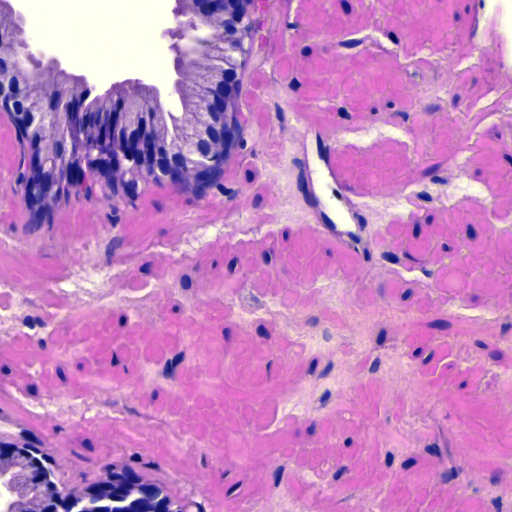
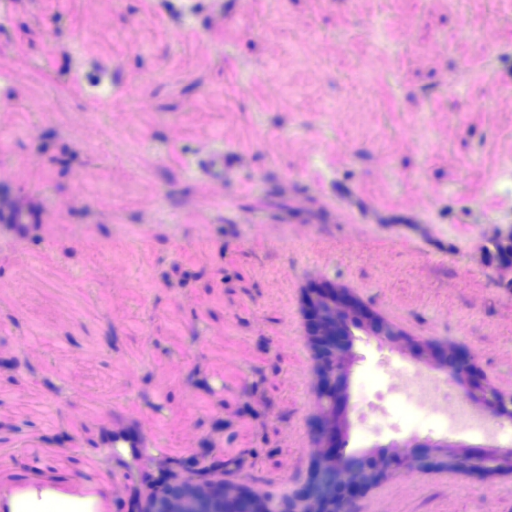
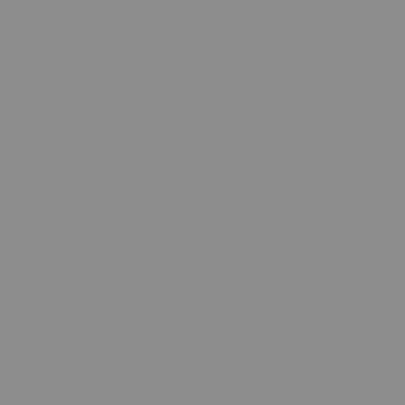

# Using the Provided Quality Control Functions
This document presents several examples of using the provided QC functions. These examples
should provide you with good overview of the offered functionality and potential limitations.

## Suggested Workflow
This library is not suited for running the provided QC methods on complete WSIs.
Instead, the functions are expected to be run on smaller WSI regions and regular PNG/JPG images.
This should provide reasonable options for debugging potential problems, while avoiding
the technical overhead needed for processing the complete WSIs.

## Examples
The following examples should provide you with the neccessary information for running the provided QC functions.

### Detecting Residual Artifacts
In this example, we will work with the following image:


#### Sample code
First, we need to import the necessary functionality and load the image into numpy array:

```python linenums="1"
import numpy as np
from PIL import Image

from rationai.qc import residual_artifacts_and_coverage
from rationai.staining import ColorConversion


img = np.asarray(Image.open("input.png").convert("RGB"))
```

Next, we will need to prepare the arguments for the [residual_artifacts_and_coverage](../api/residual_artifacts/residual-artifacts-and-coverage.md) function and call it on the input image:

```python linenums="10"

conversion = ColorConversion.RGB2HER
nucleus_area = 150
res_index = 2
threshold = 0.005

artifacts = residual_artifacts_and_coverage(
    img, conversion, nucleus_area, res_index, threshold
)
```

Since the tissue is stained with the **H&E protocol**, we used the `RGB2HER` color conversion with the corresponding index of the residual channel. The threshold value is based on the currently recommended value in the function's documentation. Finally, the nucleus area is manually approximated from the input image.

After obtaining the results, we can save the binary artifact mask and print the computed `coverage` number:

```python linenums="19"
mask = Image.fromarray(255 * artifacts["coverage_mask"].astype(np.uint8))
mask.save("residual_mask.png")

print("Coverage Number:", artifacts["coverage"])
```

The computed mask is returned as a binary image. Therefore, the computed values need to be scaled into the [0, 255] range before visualization.

#### Results
In our example, the `coverage` number came out to be `0.0766`, meaning that little more than 7% of the image's foreground area is covered by the artifact.
Finally, the computed artifact mask looks like this:


### Detecting out of focus areas

In this example, we will work with the following images:

|  |  |  |
|:-------------------------:|:------------------------:|:------------------------:|
| Focused image                | Partially blurred image               | Blurred image               |

#### Sample code
First, we need to import the necessary functionality and load the images into numpy arrays:

```python linenums="1"
import numpy as np
from PIL import Image
from rationai.staining import ColorConversion

# optional, tissue mask will be calculated inside the focus_score function if not provided as an argument
import pyvips
from rationai.masks import tissue_mask


img_a = np.asarray(Image.open("focus_A.png").convert("RGB")) # Focused image 
img_b = np.asarray(Image.open("focus_B.png").convert("RGB")) # Partially blurred image
img_c = np.asarray(Image.open("focus_C.png").convert("RGB")) # Blurred image
```

Next, we will need to prepare the arguments for the [out_of_focus](../api/focus/focus-score-piqe.md) function and call it on the input images:

```python linenums="9"
pixel_size = 0.44 # pixel size of input images in micrometers

# focus score without tissue mask
focus_score_a = focus_score_piqe(img_a, pixel_size)
focus_score_b = focus_score_piqe(img_b, pixel_size)

# focus score with tissue mask
tissue_mask = tissue_mask(
        pyvips.Image.new_from_array(img_c), mpp=pixel_size
    ).numpy()

tissue_mask  = (tissue_mask  > 0).astype(int) # binarize mask
              
focus_score_c = focus_score_piqe(img_c, pixel_size, tissue_mask )
```

The `pixel_size` parameter is used to calculate the kernel size for median filter that is used during the computation. Function gives most accurate results on images with pixel size around 0.44 micrometers. The `tissue_mask` param is optional and will be calculated inside the function if not present, but can be provided by the user to avoid unnecessary computation.

After obtaining the results, we can save the computated focus score masks or just print out any value from the score mask for quick inspection: 

```python linenums="18"

    print(focus_score_a["focus_score_piqe"][0][0])

    mask = Image.fromarray((255 * focus_score_a["focus_score_piqe"]).astype(np.uint8))
    mask.save("focus_score_a.png")

    mask = Image.fromarray((255 * focus_score_b["focus_score_piqe"]).astype(np.uint8))
    mask.save("focus_score_b.png")

    mask = Image.fromarray((255 * focus_score_c["focus_score_piqe"]).astype(np.uint8))
    mask.save("focus_score_c.png")
```

#### Results
Scores range from 0 to 1, where 1 represents the best focus.

| Score        | Focus                     |
|--------------|---------------------------|
| 0.9+         | Perfect/almost perfect focus |
| 0.9 - 0.7    | Slightly/partially blurred   |
| 0.7 - 0.4    | Visibly blurred              |
| 0.4 - 0      | Severely blurred             |


In our example, the focus scores and masks look like this:

|  |  |  |
|:-------------------------:|:------------------------:|:------------------------:|
| Focused image, Score ~0.988                | Partially blurred image, Score ~0.553               | Blurred image, Score ~0.014              |

### Detecting folded areas

In this example, we will work with the following images:

The investigated tile.


The local area of the tile.


The local area is an optional image. It increases the detection rate of particularly large folds. A suggested size is (3 * width, 3 * height) of investigated image

#### Sample code
First, we need to import the necessary functionality and load the images into numpy arrays:
```python linenums="1"
import numpy as np
from PIL import Image

import pyvips
from rationai.masks import tissue_mask


img = np.asarray(Image.open("fold.png").conver("RGB")) # Investigated image
local_area_image =img_area = np.asarray(Image.open("fold_area.png").convert("RGB")) # Local area of investigated image
```

Now we can calculate the tissue masks:
```python linenums="1"
img_mask = tissue_mask(
        pyvips.Image.new_from_array(img), mpp=pixel_size).numpy() > 0

img_area_mask = tissue_mask(
        pyvips.Image.new_from_array(local_area_img), mpp=pixel_size).numpy() > 0
```

Now we have all the arguments prepared. The folding function can be called:
```python linenums="1"
artifacts = folding(img=img,
                    mpp=1.76,
                    hematoxylin_eosin_stained=True,
                    tissue_mask=img_mask,
                    local_tiles=local_area_img,
                    local_mask=img_area_mask)
```
The level_downsample argument is the downsample rate between the highest resolution level and the level from which the image was taken. nuclues_diameter_at_base_level specifies the nucleus diameter at the highest resolution level (it can be easily measured when browsing the WSI).

#### Results
To recover the results, one need to access the dictionary `artifacts`.

```python linenums="1"
mask = Image.fromarray(255 * artifacts["folding"].astype(np.uint8))
```

