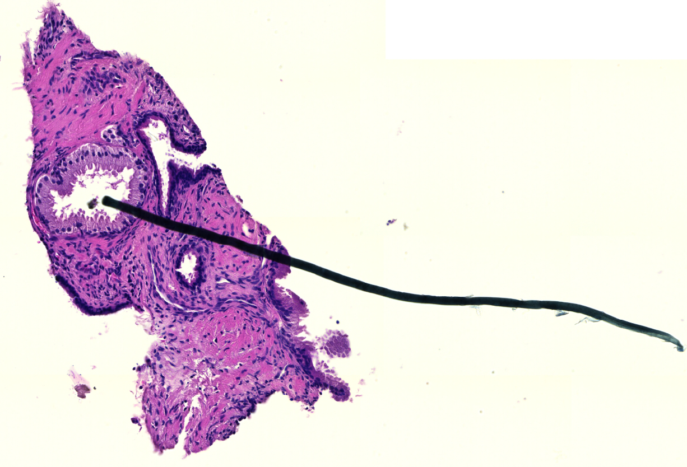
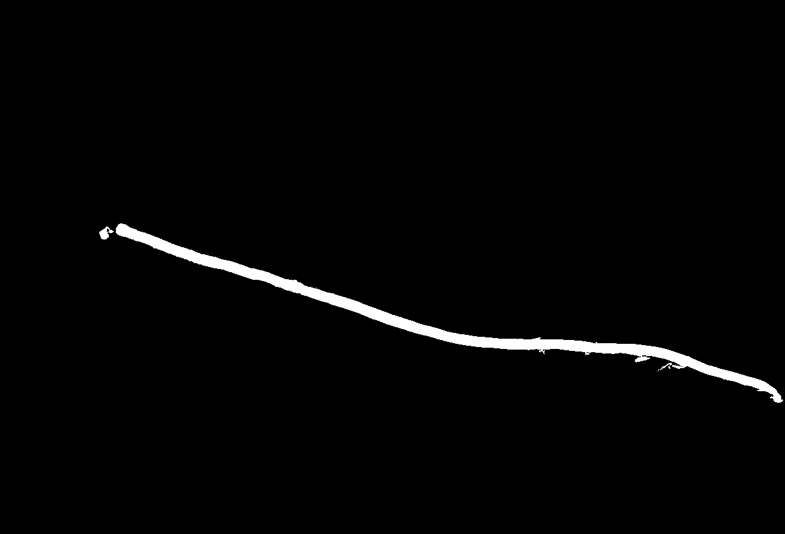
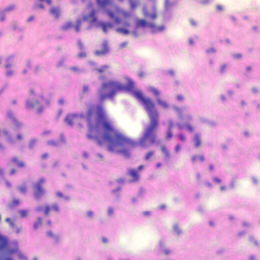
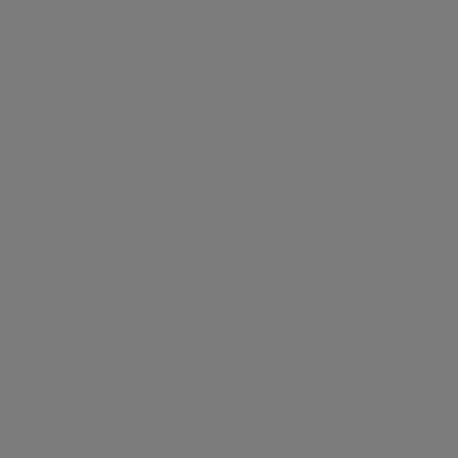
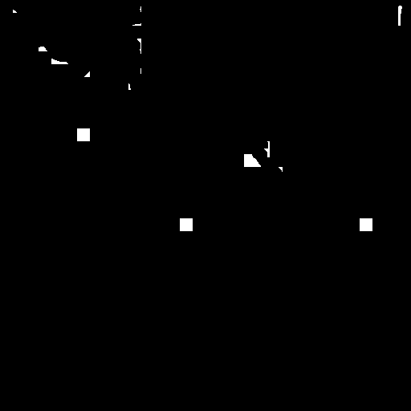
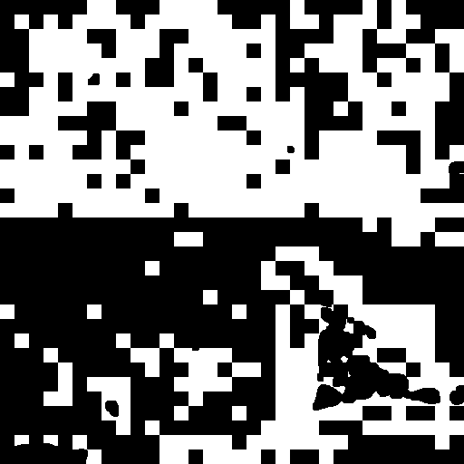
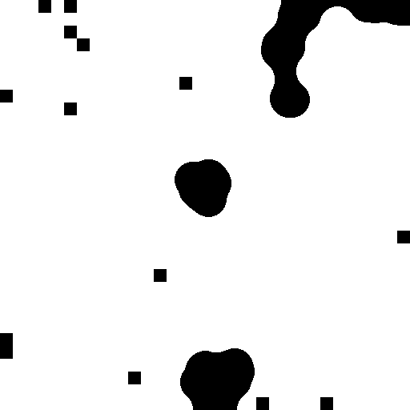
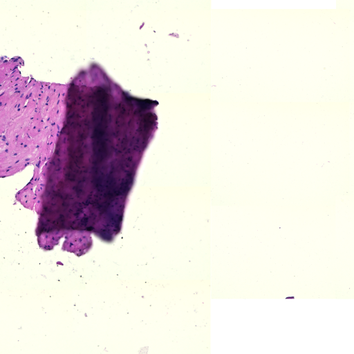
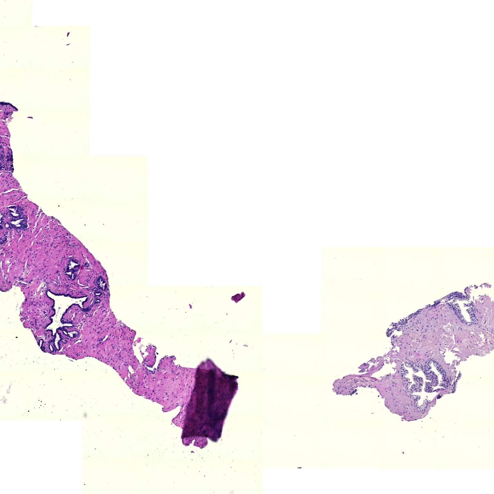
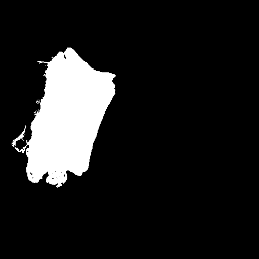

# Using the Provided Quality Control Functions

This document presents several examples of using the provided QC functions. These examples
should provide you with good overview of the offered functionality and potential limitations.

## Suggested Workflow

This library is not suited for running the provided QC methods on complete WSIs.
Instead, the functions are expected to be run on smaller WSI regions and regular PNG/JPG images.
This should provide reasonable options for debugging potential problems, while avoiding
the technical overhead needed for processing the complete WSIs.

## Examples

The following examples should provide you with the neccessary information for running the provided QC functions.

### Detecting Residual Artifacts

In this example, we will work with the following image:



#### Sample Code

First, we need to import the necessary functionality and load the image into numpy array:

```python linenums="1"
import numpy as np
from PIL import Image

from rationai.qc import residual_artifacts_and_coverage
from rationai.staining import StandardConversions


img = np.asarray(Image.open("input.png").convert("RGB"))
```

Next, we will need to prepare the arguments for the [residual_artifacts_and_coverage](../api/residual_artifacts/residual-artifacts-and-coverage.md)
function and call it on the input image:

```python linenums="10"

conversion = StandardConversions.RGB2HER
nucleus_area = 150
res_index = 2
threshold = 0.005

artifacts = residual_artifacts_and_coverage(
    img, conversion, nucleus_area, res_index, threshold
)
```

Since the tissue is stained with the **H&E protocol**, we used the `RGB2HER` color conversion with the corresponding index of the residual channel. The threshold value is based on the currently recommended value in the function's documentation. Finally, the nucleus area is manually approximated from the input image.

After obtaining the results, we can save the binary artifact mask and print the number of examined and flagged pixels:

```python linenums="19"
mask = Image.fromarray(255 * artifacts["coverage_mask"].astype(np.uint8))
mask.save("residual_mask.png")

print(f"Number of flagged pixels: {artifacts["number_of_flagged_pixels"]}")
print(f"Number of examined pixels: {artifacts["number_of_examined_pixels"]}")
```

The computed mask is returned as a binary image. Therefore, the computed values need to be scaled into the `[0, 255]` range before visualization.

#### Results

In our example, 17900 out of the 233744 examined pixels were labeled as artifacts,
meaning that **little more than 7% of the image's foreground area** is covered by artifacts.
Finally, the computed artifact mask looks like this:



### Detecting Blurry Areas

In this example, we will work with the following images:

|  |  |  |
|:-------------------------:|:------------------------:|:------------------------:|
| Focused Image                | Partially blurred Image               | Blurred Image               |

First, we need to import the necessary functionality and load the images into numpy arrays:

```python linenums="1"
import numpy as np
from PIL import Image

# optional, tissue mask will be calculated inside the blur_score function
# if not provided as an argument
import pyvips
from rationai.masks import tissue_mask


img_a = np.asarray(Image.open("blur_A.png").convert("RGB")) # Focused image
img_b = np.asarray(Image.open("blur_B.png").convert("RGB")) # Partially blurred image
img_c = np.asarray(Image.open("blur_C.png").convert("RGB")) # Blurred image
```

Next, we will need to prepare the arguments for the [blur_score_piqe](../api/blur/blur-score-piqe.md) function and call it on the input images:

```python linenums="14"
pixel_size = 0.44 # pixel size of input images in micrometers

# blur score without tissue mask
blur_score_a = blur_score_piqe(img_a, pixel_size)
blur_score_b = blur_score_piqe(img_b, pixel_size)

# blur score with tissue mask
tissue_mask = tissue_mask(
        pyvips.Image.new_from_array(img_c), mpp=pixel_size
).numpy()

tissue_mask  = (tissue_mask  > 0).astype(int) # binarize mask

blur_score_c = blur_score_piqe(img_c, pixel_size, tissue_mask )
```

The `pixel_size` parameter is used to calculate the kernel size for median filter that is used during the computation. Function gives most accurate results on images with pixel size around 0.44 micrometers. The `tissue_mask` param is optional and will be calculated inside the function if not present, but can be provided by the user to avoid unnecessary computation.

blur function outputs 2 masks - blur_score_coverage and blur_score_per_pixel.
blur_score_per_pixel is a binary mask marking the areas of the image that are considered blurred, while blur_score_coverage provides a blur coverage score for the whole image indicating the degree of blur.

After obtaining the results, we can save the computated blur score masks.
Since blur_score_coverage is homogeneous across the image, we can just print out any value from the score mask for quick inspection:

```python linenums="29"

print(blur_score_a["blur_score_coverage"][0][0])

# save the coverage masks

mask = Image.fromarray((255 * blur_score_a["blur_score_coverage"]).astype(np.uint8))
mask.save("blur_score_a.png")

mask = Image.fromarray((255 * blur_score_b["blur_score_coverage"]).astype(np.uint8))
mask.save("blur_score_b.png")

mask = Image.fromarray((255 * blur_score_c["blur_score_coverage"]).astype(np.uint8))
mask.save("blur_score_c.png")


# save the per pixel masks

mask = Image.fromarray((255 * blur_score_a["blur_score_per_pixel"]).astype(np.uint8))
mask.save("blur_score_a_pixel.png")

mask = Image.fromarray((255 * blur_score_b["blur_score_per_pixel"]).astype(np.uint8))
mask.save("blur_score_b_pixel.png")

mask = Image.fromarray((255 * blur_score_c["blur_score_per_pixel"]).astype(np.uint8))
mask.save("blur_score_c_pixel.png")
```

#### Results

Coverage scores range from 0 to 1, where 0 represents the best focus and 1 represents complete blur.

| Score        | Focus Level                |
|--------------|---------------------------|
| 0 - 0.1      | Perfect/almost perfect focus |
| 0.1 - 0.3    | Slightly/partially blurred   |
| 0.3 - 0.7    | Visibly blurred              |
| 0.7 - 1      | Severely blurred             |

In our example, the focus scores and masks look like this:

|  |  |  |
|:-------------------------:|:------------------------:|:------------------------:|
| Focused image, Score ~0.005                | Partially blurred image, Score ~0.488               | Blurred image, Score ~0.985              |

Per-pixel mask is binary mask composed of 16x16 px blocks marking blurred areas.
Background pixels and focused blocks are marked as 0, while blurred blocks are marked as 1.

|  |  |  |
|:-------------------------:|:------------------------:|:------------------------:|
| Focused image                | Partially blurred image             | Blurred image             |

Please note that blocks of the per-pixel mask may be 1 not only for globally blurred regions, but also for locally defocused or sparse areas (e.g. tissue gaps or empty regions). This means a value of 1 does not always imply a complete blur.

### Detecting Folded Areas

In this example, we will work with the following images:

The investigated tile.



The local area of the tile.



The local area is an optional image. It increases the detection rate of particularly large folds. A suggested size is `(3 * width, 3 * height)` of investigated image

#### Sample Code

First, we need to import the necessary functionality and load the images into numpy arrays:

```python linenums="1"
import numpy as np
from PIL import Image

import pyvips
from rationai.masks import tissue_mask


img = np.asarray(Image.open("fold.png").convert("RGB")) # Investigated image
local_area_image =img_area = np.asarray(Image.open("fold_area.png").convert("RGB")) # Local area of investigated image
```

Now we can calculate the tissue masks:

```python linenums="11"
img_mask = tissue_mask(
        pyvips.Image.new_from_array(img), mpp=pixel_size).numpy() > 0

img_area_mask = tissue_mask(
        pyvips.Image.new_from_array(local_area_img), mpp=pixel_size).numpy() > 0
```

Now we have all the arguments prepared. The folding function can be called:

```python linenums="17"
artifacts = folding(img=img,
                    mpp=1.76,
                    hematoxylin_eosin_stained=True,
                    tissue_mask=img_mask,
                    local_tiles=local_area_img,
                    local_mask=img_area_mask)
```

The `level_downsample argument` is the downsample rate between the highest resolution level and the level from which the image was taken.
`nuclues_diameter_at_base_level` specifies the nucleus diameter at the highest resolution level (it can be easily measured when browsing the WSI).

#### Results

To recover the results, one needs to access the `artifacts` dictionary.

```python linenums="24"
mask = Image.fromarray(255 * artifacts["folding"].astype(np.uint8))
```


